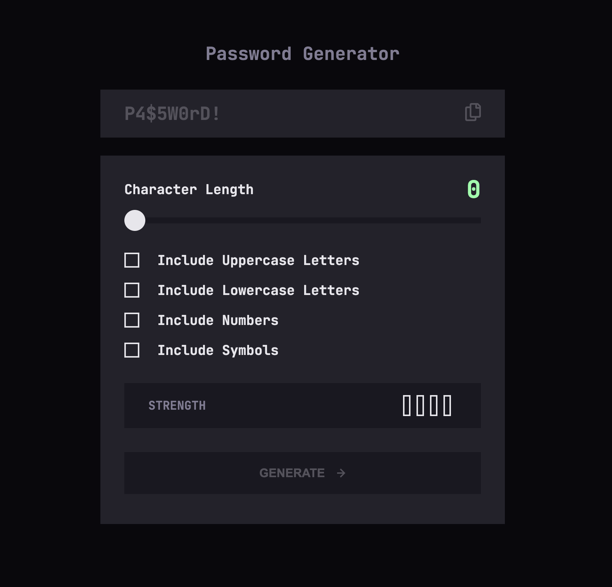

# Frontend Mentor - Password generator app solution

This is a solution to the [Password generator app challenge on Frontend Mentor](https://www.frontendmentor.io/challenges/password-generator-app-Mr8CLycqjh). Frontend Mentor challenges help you improve your coding skills by building realistic projects.

## Table of contents

- [Frontend Mentor - Password generator app solution](#frontend-mentor---password-generator-app-solution)
  - [Table of contents](#table-of-contents)
  - [Overview](#overview)
    - [The challenge](#the-challenge)
    - [Screenshot](#screenshot)
    - [Links](#links)
  - [My process](#my-process)
    - [Built with](#built-with)
    - [What I learned](#what-i-learned)
    - [Continued development](#continued-development)
    - [Useful resources](#useful-resources)
  - [Author](#author)

**Note: Delete this note and update the table of contents based on what sections you keep.**

## Overview

### The challenge

Users should be able to:

-   Generate a password based on the selected inclusion options
-   Copy the generated password to the computer's clipboard
-   See a strength rating for their generated password
-   View the optimal layout for the interface depending on their device's screen size
-   See hover and focus states for all interactive elements on the page

### Screenshot

### Links

-   Solution URL: [https://github.com/EmLopezDev/Password-Generator](https://github.com/EmLopezDev/Password-Generator)
-   Live Site URL: [https://emlopezdev.github.io/Password-Generator/](https://emlopezdev.github.io/Password-Generator/)

## My process

-   First I wrote out all the semantic SCSS with class names and ids
-   Then I added all the styles and responsiveness to the app
-   Finally I added the functionality one part at the time, starting with getting all the input values, then generating the pw based on the input, then adding validation with strength gauge, and finally the ability to copy

### Built with

-   Semantic HTML5 markup
-   SCSS custom properties, functions, and mixins
-   Flexbox
-   Mobile-first workflow
-   JavaScript

### What I learned

-   I learned some cool things like how to style a range input, how to copy text to the clipboard, and how to better deal with numbers and operators.

### Continued development

-   I want to continue taking on harder challenges with JS becase things are begining to really click for me and I would like to get to a point where I can comfortably take on any challenge no matter the difficulty.

### Useful resources

-   [Styling Range Input](https://blog.logrocket.com/creating-custom-css-range-slider-javascript-upgrades/) - A nice approach to change the look and feel of a range input.
-   [Copy to clipboard](https://medium.com/@aryanvania03/how-do-i-copy-to-the-clipboard-in-javascript-b3cfe55d626b) - This helped understand how to copy to the clipboard.

## Author

-   Frontend Mentor - [@EmLopezDev](https://www.frontendmentor.io/profile/EmLopezDev)
